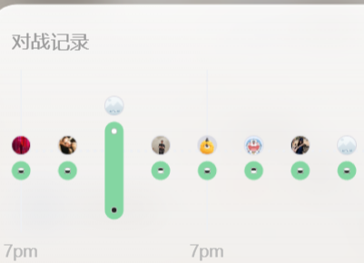

<div align="center">

# 五子棋对局助手 / Gomoku Assistant

**纯本地 · 免安装 · 免费** · **Local-first · Portable · Free**

无禁手五子棋对局辅助工具 — 对面落子后点一下，引擎立刻给出最佳应手


[简体中文](#简体中文) · [English](#english)

</div>

<a name="简体中文"></a>

# 简体中文

> **本项目由 AI（大语言模型）辅助开发完成**——代码编写、bug 排查、性能优化、战术修补均由人类与 AI 协作迭代完成。

## 🏆 实战检验

作者使用本工具的连续对局记录（同一天 8 连胜）：

<p align="center">
  
</p>

> 以上为作者个人自测记录，实际表现因对手水平而异。

## 💡 它是怎么工作的

**「程序 = 你」**：你在外部棋盘正常对弈，程序在本地同步记录局面并实时计算。

1. 点「执黑先手」或「执白后手」开局
2. 对面落子后，你在程序棋盘上**点一下对面那颗子**
3. 引擎立刻算出你的最佳应手，**红圈标记**在棋盘上
4. 照着下，循环往复

引擎决策链：**直接成五 → 堵对方成五 → 我方连续冲四算杀（VCF）→ 拆解对方算杀 → 开局库 → PVS 迭代加深搜索**（置换表 + Zobrist 哈希 + 增量评估 + 融合棋型评分）。

## ✨ 功能特性

- **开局库加持**：前 5 手由 KataGomo（KataGo 衍生引擎）高访问量离线分析生成，开局即有引擎级质量，首步零等待
- **时间管理**：每步约 2 秒；局面收敛自动提前落子，困难局面自动用满预算
- **对局日志**：每局自动记录双方每手棋、引擎理由与终局盘面，可精确复盘
- **无头自检**：`--selftest` 一条命令验证引擎全部战术逻辑
- **DPI 适配**：Windows 125%/150% 缩放下点击精准
- **纯本地运行**：不联网、不调用在线接口、完全免费

## ⚠️ 已知缺点与局限（诚实清单）

1. **深层连续冲杀（VCT）视野有限**：每步 2 秒约搜索 5~6 层，对 5 步以上连续连杀的防守可能不完美（VCT 已列入计划）
2. **棋力定位**：经典搜索 + 人工棋型评估，属"业余高水平"，明显低于 Rapfi / KataGomo 等顶级 AI（那些依赖神经网络，本项目刻意不用）
3. **仅支持无禁手规则**与 **15×15 标准棋盘**
4. **开局库仅覆盖前 5 手**
5. **编译版引擎仅支持 64 位 Windows + Python 3.12**

## 🚀 快速开始

**下载即用（推荐）**：到 **[Releases](../../releases)** 下载 `五子棋对局助手.exe`，双击运行（免安装，无需 Python）。exe 内含 Nuitka 编译引擎与开局库，与作者自用版本完全一致。

**从源码运行**：Windows + Python 3.8 以上，纯标准库零依赖：

```bat
python gomoku.py
```

> 源码模式功能完全相同，但引擎为解释执行，搜索速度约慢 45%，棋力略降一档。

**构建编译版（进阶）**：需要完整版 CPython 3.12、Nuitka、MinGW64、PyInstaller；参考 `build_exe.bat`（路径为本机示例，按需修改）。

## 📖 使用说明

| 步骤 | 操作 |
|---|---|
| 1 开局 | 点「执黑先手」或「执白后手」 |
| 2 记子 | 对面落子后，在程序棋盘上点一下对面那颗子 |
| 3 照下 | 程序红圈标记的应手，照着下到外部棋盘 |
| 4 循环 | 重复 2~3；一方连五后点棋盘可开下一局 |

Esc 退出 · 日志在 `文档\五子棋对局助手日志\`（新开局自动清除上一局）· 自检 `五子棋对局助手.exe --selftest`

## 📦 仓库文件

`gomoku.py`（界面层）· `gomoku_engine.py`（引擎）· `gomoku_opening_book.json`（开局库）· `build_exe.bat`（构建脚本示例）· `LICENSE` · `images/`

## 🤖 AI 辅助开发声明

产品定位、决策链设计与最终取舍由人类完成；搜索优化（PVS、增量评估、融合评分、时间管理）由 AI 驱动实现并以 A/B 对局逐项验证，无收益方案全部回退；关键 bug（评估视角不对称、成五点评分缺失等）由 AI 通过日志复盘与仪表化调试定位修复；开局库由 AI 驱动的 KataGomo 离线挖掘管线生成。

## 📚 致谢

开局库由 **[KataGomo](https://github.com/hzyhhzy/KataGomo)**（基于 [KataGo](https://github.com/lightvector/KataGo)，MIT License）离线分析生成。搜索设计参考 Gomocup 社区公开资料（Rapfi、Embryo、Carbon）与 Allis 的威胁空间搜索论文，未使用其任何源代码。

## ⚠️ 免责声明

本项目仅供本地学习、分析与技术研究。请在遵守你对弈平台服务条款的前提下使用，因违规使用导致的账号封禁等后果由使用者自行承担。

---

<a name="english"></a>

# English

> **This project was developed with AI assistance** — coding, bug hunting, performance optimization and tactics fixes were all built through human–AI collaboration.

## 🏆 Real-Game Results

Author's record using this tool (8 straight wins in one day):

<p align="center">
  
</p>

> Personal test record; results vary with opponent strength.

## 💡 How It Works

**"The app plays as you"**: you play on any external board; the app tracks the position locally and computes your best move in real time.

1. Click **Black** or **White** to start
2. After your opponent moves, **click their stone** on the app's board
3. The engine instantly shows its recommended reply, marked with a **red circle**
4. Play that move and repeat

Decision pipeline: **win-in-one → block opponent's five → own VCF search → break opponent's VCF → opening book → PVS iterative-deepening search** (transposition table + Zobrist hashing + incremental evaluation + fused pattern scoring).

## ✨ Features

- **Opening book**: moves up to ply 5 generated offline by KataGomo (a KataGo derivative) at high visit counts — engine-grade openings, zero wait for the first move
- **Time management**: ~2 s per move; exits early on converged positions, uses the full budget on complex ones
- **Game logging**: every move, engine rationale and final position saved automatically
- **Headless self-test**: `--selftest` verifies all tactical logic in one command
- **DPI-aware**: accurate clicking at 125%/150% Windows scaling
- **Fully offline**: no network, no cloud APIs, free forever

## ⚠️ Known Limitations (honest list)

1. **Shallow VCT vision**: at ~5–6 plies/2 s, defenses against 5+ ply forced sequences may be imperfect (VCT on the roadmap)
2. **Strength level**: classic search + handcrafted evaluation ("strong amateur"); clearly below neural engines like Rapfi/KataGomo (intentionally not used here)
3. **Freestyle (no-forbidden-rules) Gomoku only**, 15×15 board only
4. **Opening book covers only the first 5 plies**
5. **Compiled engine: 64-bit Windows + Python 3.12 only**

## 🚀 Quick Start

**Portable (recommended)**: download `五子棋对局助手.exe` from **[Releases](../../releases)** — no installation, no Python required. It embeds the Nuitka-compiled engine and the opening book, identical to the author's own build.

**From source**: Windows + Python 3.8+, pure standard library, zero dependencies:

```bat
python gomoku.py
```

> Identical features from source, but ~45% slower search (interpreted), so slightly weaker play.

**Build the compiled version (advanced)**: full CPython 3.12, Nuitka, MinGW64, PyInstaller — see `build_exe.bat` (paths are examples).

## 📖 Usage

| Step | Action |
|---|---|
| 1 | Click Black or White to start |
| 2 | After each opponent move, click their stone on the app's board |
| 3 | Play the move marked with the red circle on your real board |
| 4 | Repeat; click the board to start a new game after one side wins five-in-a-row |

Esc quits · logs saved to `Documents\五子棋对局助手日志\` · self-test: `五子棋对局助手.exe --selftest`

## 📦 Repository Files

`gomoku.py` (UI) · `gomoku_engine.py` (engine) · `gomoku_opening_book.json` (book) · `build_exe.bat` (build example) · `LICENSE` · `images/`

## 🤖 AI-Assisted Development Statement

Product direction, decision-chain design and final trade-offs by the human author; search optimizations (PVS, incremental evaluation, fused pattern scoring, time management) implemented under AI guidance and adopted only after A/B game validation; key bugs (asymmetric evaluation perspective, invisible five-completing points) diagnosed and fixed via AI-driven log replay and instrumented debugging; the opening book was mined via an AI-driven KataGomo pipeline.

## 📚 Acknowledgements

Opening book generated offline with **[KataGomo](https://github.com/hzyhhzy/KataGomo)** (based on [KataGo](https://github.com/lightvector/KataGo), MIT License). Search design informed by public Gomocup community material (Rapfi, Embryo, Carbon) and L. V. Allis's threat-space search papers — no third-party source code is used.

## 📄 License

[MIT License](LICENSE)

## ⚠️ Disclaimer

For local study, analysis and research only. Use it in compliance with your game platform's terms of service; the author is not responsible for consequences of misuse.
